<!-- ════════════════════════════════════════════════════════════════
        prodev2025 · GitHub profile README
        Dark-neon "aura" aesthetic · cyan #00F5FF → violet #8B5CF6 → magenta #FF00E5 on #0D1117
        ONE authored hero + tight identity, then restrained grouped widgets:
        stack · featured pin · numbers · 3 signature contribution visuals.
        Every widget is live, free, stat-honest, and shares the exact palette.
═════════════════════════════════════════════════════════════════ -->

<!-- ░░░ HERO — bespoke, self-animating SVG (lives at assets/hero.svg) ░░░ -->
<!-- Hand-authored vector banner. Served as an image, so GitHub proxies the bytes
     and the browser renders the inline CSS @keyframes. (In  context only
     DECLARATIVE animation runs — no JS, no external fonts/images. This SVG uses
     embedded <path>/<text> + system fonts + CSS only, so it animates.)
     Relative path => resolves to this repo's default branch automatically,
     so it works whether the branch is `main` or `master`. -->

**Lasha** — founder of **TurboGem** · Rust backend · systems, web3, security

<!-- Add real URLs, then uncomment — kept out so nothing renders as a dead link.

-->

### `$ whoami`

Founder of **TurboGem** — an automotive-AI platform — and a **Rust backend engineer** shipping **12K+ lines of production Rust**. I build fast, safe systems with a bias toward performance, security, and clean architecture.

- **TurboGem** — Rust backend: services, scrapers, a multi-provider AI router for real-time vehicle intelligence
- **Rust, deeper** — performance-critical async services, zero-cost abstractions, kernel-adjacent ambitions
- **Stack** — Rust · Python · TypeScript · Docker · PostgreSQL · Redis · Linux

### Featured

<!-- The pin only renders if a PUBLIC repo named exactly `turbogem-backend` exists
     under prodev2025. Rename the `repo=` param if your slug differs (local working
     copy is `turbogem-backend-main`). Themed with exact brand hex (not a preset). -->

### By the numbers

<!-- Host note: github-readme-stats.vercel.app is the shared public instance and can
     occasionally 429. For 100% uptime, deploy your own Vercel fork of
     anuraghazra/github-readme-stats and swap the hostname below. -->

### Contribution graph

<!-- 3D isometric skyline — committed into ./profile-3d-contrib/ by the
     "GitHub-Profile-3D-Contrib" Action (profile-3d.yml). night-rainbow is the
     neon dark variant. Blank until that Action runs once — seed it from the
     Actions tab. Relative path => default-branch agnostic. -->

<!-- The snake game — generated by the "Generate Snake" Action (snake.yml) and
     pushed to the `output` branch as github-snake.svg / github-snake-dark.svg.
     Different branch, so this MUST be an absolute raw URL. Blank until seeded. -->

<picture>
  <source media="(prefers-color-scheme: dark)" srcset="https://raw.githubusercontent.com/prodev2025/prodev2025/output/github-snake-dark.svg" />
  <source media="(prefers-color-scheme: light)" srcset="https://raw.githubusercontent.com/prodev2025/prodev2025/output/github-snake.svg" />
  
</picture>

<!-- Neon activity line — renders immediately, no Action needed. -->

<!-- ░░░ FOOTER WAVE — mirrored gradient bookend (magenta → violet → cyan), echoes the hero ░░░ -->

