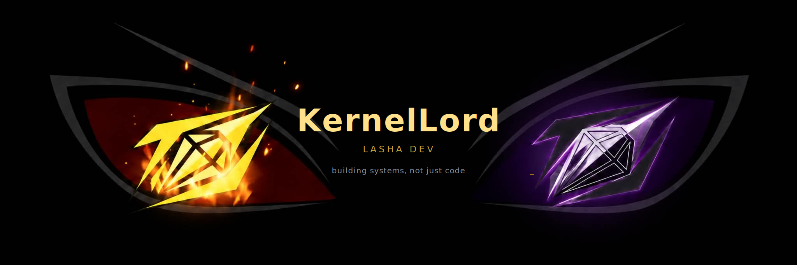
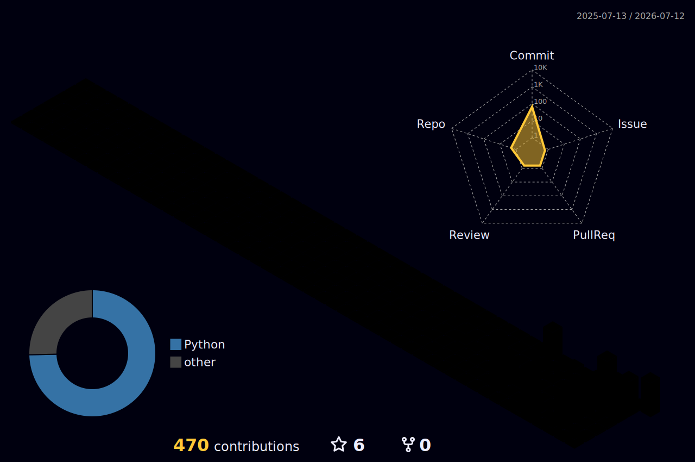

<!-- ════════════════════════════════════════════════════════════════
        KernelLord · Lasha Dev · GitHub profile README
        Gold #F5B301 / #FFC83D · Purple #A855F7 / #8B5CF6 · Crimson #B11226 · on #0D0D0D
        One shared hex tuple across every widget (no stock themes) for a bespoke,
        cohesive "aura" that matches the custom blinking-eyes banner.
        Confident-for-0-public-repos: name the private work, don't apologize for it.
═════════════════════════════════════════════════════════════════ -->

<!-- ░░░ HERO — bespoke blinking-eyes banner (assets/banner.svg) ░░░ -->
<!-- Hand-authored SVG: the eyes image is embedded as base64 (self-contained, so it
     survives GitHub's image proxy) and the eyelids blink via SMIL <animate>.
     Relative path => resolves to the repo's default branch automatically. -->

<!-- status row — kernel boot-flags as badges -->

<!-- Add real URLs, then uncomment — kept out so nothing renders as a dead link.

-->

### `> ./boot`

I architect and ship fast, safe systems — Rust backends, async services, security-first by default. Developer · architect · founder mindset.

### ⚡ Currently in the forge

> **TurboGem** — automotive-AI platform · Rust backend (services, scrapers, a multi-provider AI router) · *private until launch.*
> Systems over surface. When the repos open, they open loud.

### `> stack`

### Contribution aura

<!-- These read your contribution CALENDAR (not public repos), so they light up with
     private work once you enable Settings → Profile → "Include private contributions
     on my profile". Activity graph renders immediately; 3D skyline + snake fill in
     after their Actions run once (see PUBLISH.md). -->

<picture>
  <source media="(prefers-color-scheme: dark)" srcset="https://raw.githubusercontent.com/KernelLord/KernelLord/output/github-snake-dark.svg" />
  <source media="(prefers-color-scheme: light)" srcset="https://raw.githubusercontent.com/KernelLord/KernelLord/output/github-snake.svg" />
  
</picture>

### `> systems log`

<!-- Host note: github-readme-stats.vercel.app is the shared instance and can 429.
     For 100% uptime AND to surface PRIVATE TurboGem commits as real numbers, deploy
     your own Vercel fork of anuraghazra/github-readme-stats with a PAT, then swap the
     hostname below (count_private only counts private work on a self-hosted instance). -->

